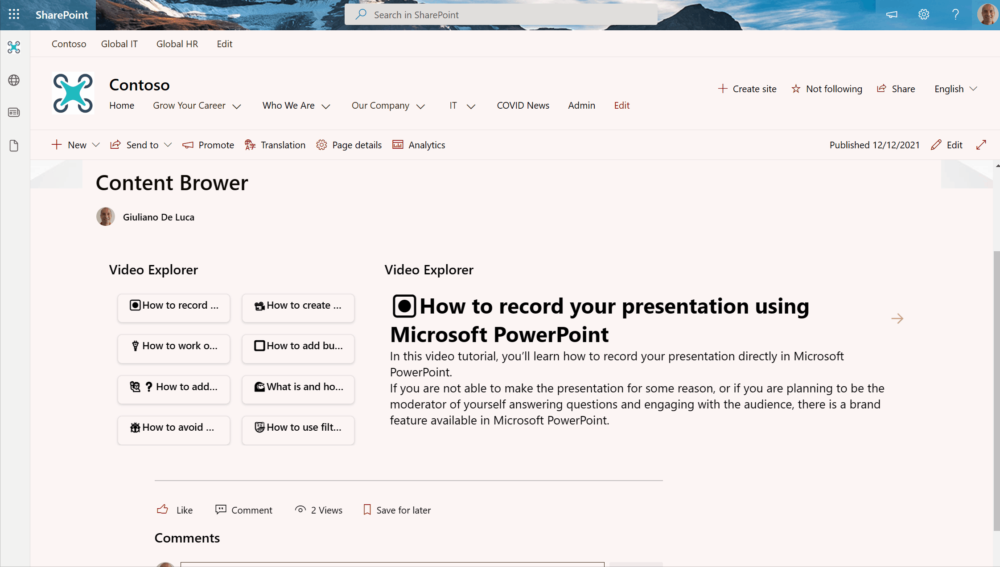

# 🧭How to create a content explorer view in Microsoft Lists
This sample demonstrates how to use Microsoft List view and column formatting to create a dynamic list with navigation

## Requirements
The following column have to be created in the SharePoint list:

- **Description**: Multiline text (no rich html field) column

📺check my YouTube Video tutorial to follow a step-by-step guide:

https://youtu.be/fWYntPmwCac

🔗Microsoft article about List Formatting:
https://docs.microsoft.com/en-us/sharepoint/dev/declarative-customization/column-formatting
